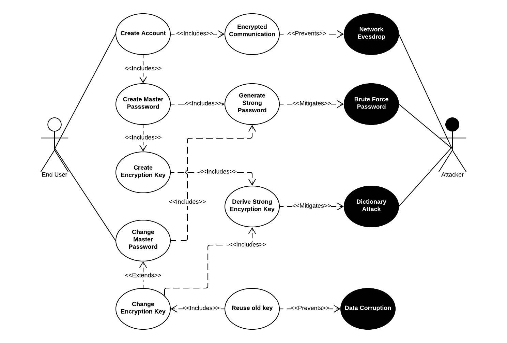

# Requirements for Software Security Engineering

## Backstory

NOTE: Scope is open for discussion 

Bitwarden is an open-source online password management service. This software has earned a good reputation for security as all sensitive information is encrypted client side before it is sent to online vault and is recoverable by only using the master password supplied by the end user. In other words, if the end user forgets their master password, the items encrypted in the vault will not be recoverable. This software supports a multitude of client applications and devices that all can be used to sync to the online vault. Although the software is free, some features  are only available with premium accounts and/or family/commercial plans. Due to price, security and features like 2 factor authentication., data sharing, etc.. this software has appeal to both the individual user as well as commercial businesses as well. 

Since the majority of our focus will be client side since that is where the majority of the security features are implemented. As mentioned above, this software supports several platforms and we will be primarily focused on the command line client but make look at desktop and browser extensions if we feel there may be something unique to those clients worth pursuing. Mobile devices will be outside the scope of this evaluation however. 

## Essential Data Flows: 

### 1. Manage master password / encryption key 

#### Use Cases

When end user first creates their account, they are prompted to create a master password. Encryption key is then derived from master password using a strong encryption key derivation algorithm.

End user can update master password at any time, but that will not automatically result in derivation of new encryption key. End user will be given the option to derive new encryption key with new master password if they feel encryption key may be at risk of compromise.

#### Misuse Cases / Security Requirements

The software should ensure all communication between client and server is encrypted to protect against network eavesdropping.

The software should proved password validation to ensure that chosen master password meets minimum complexity requirements and is considered a strong password which will protect against brute force attacks.

The software should ensure that the algorithm used to derive encryption key from master password and its implementation are considered strong and have been public ally vetted to protect against reversal attacks.

In the event the encryption key is changed, the software should be prevent clients from using old encryption key to protect against data corruption. 

#### Alignment of Security Requirements

Bitwarden encrypts all sensitive data client side and only connects to online service over a TLS socket.

Bitwarden does have a password validation tool however it is only suggestive, therefore an end user will be allowed to use a weak master password.

Bitwarden the PBKDF2 SHA-256 algorithm for password derived encryption key algorithm. It uses open libraries and meet current industry standards for its implementation.

Bitwarden will try to log out any clients that still are connected to server however it strongly recommended that the user log out and in of any clients when changing encryption key. Failure to do so may result in data corruption.

#### UML Diagram

### 2. Import / Export Sensitive Information 

#### Use Cases

#### Misuse Cases / Security Requirements

#### Alignment of Security Requirements

#### UML Diagram

### 3. Manaage Sensitive items 

#### Use Cases

#### Misuse Cases / Security Requirements

#### Alignment of Security Requirements

#### UML Diagram

### 4. Sharing of Sensitive items 

#### Use Cases

#### Misuse Cases / Security Requirements

#### Alignment of Security Requirements

#### UML Diagram

